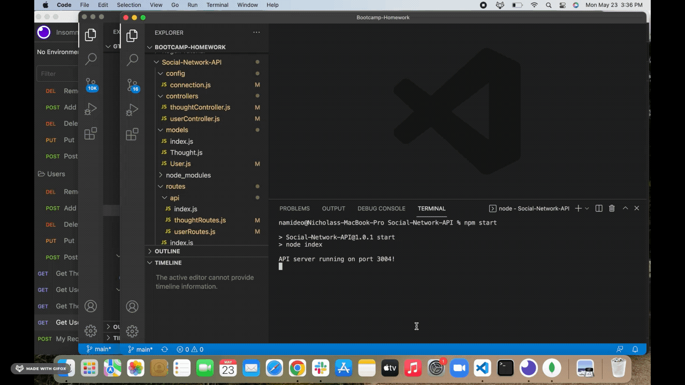

# Social-Network-API

## Objective
The purpose of this assignment is to develop a social networking API that allows a user to creat comments and respond to other comments, as well as addng other users to their friends list. This application will be implementing MongoDB and utilizing Express.js and Insomnia. 

## Criteria
* When I run "npm start" in the command line the application runs and is connected to the Mongo Database.

* When I go into Insomnia I am connected to the server and am able to do GET requests for all Users and Thoughts. I can also pull individual Users and Thoughts by their id. 

* When I test my POST, PUT, and DELETE routes in Insomnia, I am able to create, update, and remove Users and Thoughts. 

* I am also able to add or remove other users from a user's friend list using POST and DELETE. 

* I am also able to add or remove Reactions from my Thoughts using POST and DELETE. 

## Mock Up
The following mock up shows the GET routes for all USER and THOUGHTS as well as by ID. 

POST, PUT, DELETE routes for USER, as well as add and remove Friend. 

POST, PUT, DELETE routes for THOUGHTS, as well as add and remove Reaction. 

